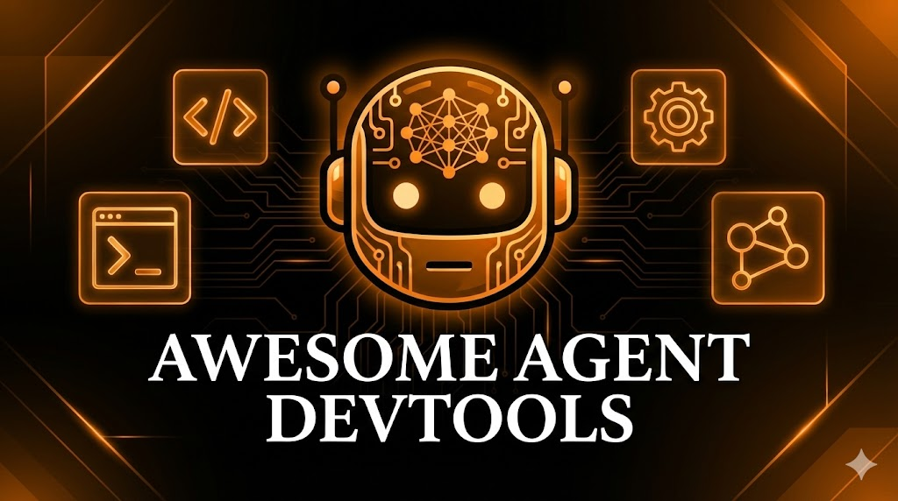

<div align="center">



# Awesome Agent Toolkit

> A curated collection of essential configurations, skills, prompts, and workflows for AI-powered development tools

[](https://github.com/Bosh-Kuo/awesome-agent-toolkit)
[](https://github.com/Bosh-Kuo/awesome-agent-toolkit)

</div>


## 📖 About

**Awesome Agent Toolkit** is a tool-agnostic repository accumulated through my own daily development work. This collection is a blend of resources gathered from the open-source community and insights gained from my personal experience, curated to form the most effective development toolkit for my daily needs.

Whether you're using Claude Code, Codex, Antigravity, Windsurf, Cursor, or any other AI coding assistant, this collection provides reusable configurations and resources that can be easily adapted to your preferred tool. The focus is on **content quality** and **portability** rather than tool-specific implementations.

### Why Tool-Agnostic?

Modern AI development tools share similar underlying concepts:
- **MCP (Model Context Protocol)** servers for extending capabilities
- **Custom rules** for guiding AI behavior
- **Agent skills** for specialized tasks
- **Prompts** for consistent interactions
- **Workflows** for repeatable processes

By focusing on these universal concepts, this repository remains valuable regardless of which AI tool you choose.

---

## 📂 Repository Structure

```
awesome-agent-devtools/
├── mcp-configs/      # Model Context Protocol server configurations
├── rules/            # Custom rules for AI behavior
├── skills/           # Agent skills for specialized tasks
├── prompts/          # Reusable prompt templates
└── workflows/        # Automated workflow definitions
```

---

## 🔌 MCP Configurations

Model Context Protocol (MCP) servers extend your AI assistant's capabilities by connecting to external tools and data sources.

### Available MCP Servers

| Name                      | Description                                                                                | Link                                               | Source                                                               | Added to Repo |
| ------------------------- | ------------------------------------------------------------------------------------------ | -------------------------------------------------- | -------------------------------------------------------------------- | ------------- |
| **Context7**              | Access up-to-date documentation and code examples for any programming library or framework | [Config](./mcp-configs/context7.json)              | [Official Site](https://context7.com/)                               | 2026-01-21    |
| **Chrome DevTools**       | Interact with Chrome browser for testing, debugging, and automation                        | [Config](./mcp-configs/chrome-devtools-mcp.json)   | [Chrome Blog](https://developer.chrome.com/blog/chrome-devtools-mcp) | 2026-01-21    |
| **MCP Feedback Enhanced** | Enhanced feedback and debugging capabilities with web interface                            | [Config](./mcp-configs/mcp-feedback-enhanced.json) | [GitHub](https://github.com/hexonal/mcp-feedback-enhanced)           | 2026-01-21    |

### MCP Resources

Discover more MCP servers from these curated collections:
- [Cursor MCP Directory](https://cursor.directory/mcp) - Community-curated MCP servers
- [MCP.so](https://mcp.so/) - Official MCP server registry

---

## 📏 Rules

> Coming soon

Custom rules help guide AI behavior and enforce coding standards across your projects.

---

## 🎯 Skills

Agent skills are specialized instruction sets that enable AI assistants to perform complex, domain-specific tasks. Each skill contains detailed guidelines, best practices, and workflows for specific domains.

### Available Skills

| Name                            | Description                                                                                                                       | Link                                          | Source                                                                                       | Added to Repo |
| ------------------------------- | --------------------------------------------------------------------------------------------------------------------------------- | --------------------------------------------- | -------------------------------------------------------------------------------------------- | ------------- |
| **UI/UX Pro Max**               | Comprehensive design intelligence with 50+ styles, 97 color palettes, 57 font pairings, and 99 UX guidelines across 9 tech stacks | [Skill](./skills/ui-ux-pro-max)               | [Official Site](https://ui-ux-pro-max-skill.nextlevelbuilder.io/)                            | 2026-01-21    |
| **Vercel React Best Practices** | React and Next.js performance optimization, patterns, and best practices from Vercel                                              | [Skill](./skills/vercel-react-best-practices) | [GitHub](https://github.com/vercel-labs/agent-skills/tree/main/skills/react-best-practices)  | 2026-01-21    |
| **Skill Creator**               | Meta-skill for creating new agent skills with proper structure and documentation                                                  | [Skill](./skills/skill-creator)               | [GitHub](https://github.com/anthropics/skills/tree/main/skills/skill-creator)                | 2026-01-21    |
| **Web Design Guidelines**       | Modern web design principles, patterns, and accessibility guidelines                                                              | [Skill](./skills/web-design-guidelines)       | [GitHub](https://github.com/vercel-labs/agent-skills/tree/main/skills/web-design-guidelines) | 2026-01-21    |

### Skills Resources

Discover more agent skills:
- [SkillsMP](https://skillsmp.com/) - Community marketplace for agent skills

### Skill Creation Tools

Tools to help you create your own skills:
- [Skill Seekers](https://github.com/yusufkaraaslan/Skill_Seekers) - Interactive skill creation and management tool

---

## 💬 Prompts

> Coming soon

Reusable prompt templates for common development tasks and interactions.

---

## 🔄 Workflows

> Coming soon

Automated workflow definitions for repeatable development processes.

---

## 🚀 Getting Started

1. **Clone this repository:**
   ```bash
   git clone https://github.com/yourusername/awesome-agent-devtools.git
   cd awesome-agent-devtools
   ```

2. **Browse the directories** to find resources relevant to your needs

3. **Copy and adapt** configurations to your AI tool of choice

4. **Customize** as needed for your specific workflow

---

## 🌟 Acknowledgments

Special thanks to the open-source community and the developers of:
- Model Context Protocol (MCP)
- All the MCP server maintainers
- AI tool developers who make these integrations possible


## ⭐️ AI Coding Tools I've Explored

<div align="center">


![Augment Code](https://img.shields.io/badge/Augment_Code-10A37F?style=for-the-badge&logo=data:image/svg+xml;base64,PHN2ZyB4bWxucz0iaHR0cDovL3d3dy53My5vcmcvMjAwMC9zdmciIHdpZHRoPSI1MTIiIGhlaWdodD0iNTEyIiBmaWxsPSJub25lIj4KICA8c3R5bGU+CiAgICBwYXRoIHsgZmlsbDogIzAwMDAwMDsgfQogICAgQG1lZGlhIChwcmVmZXJzLWNvbG9yLXNjaGVtZTogZGFyaykgewogICAgICBwYXRoIHsgZmlsbDogI2ZmZmZmZjsgfQogICAgfQogIDwvc3R5bGU+CiAgPHBhdGggZD0iTTc4Ljg0NCA0NjQuNzYyYy04LjQ1MyAwLTE1LjU3My0xLjQ1MS0yMS4zNTktNC4zMzktNS43Ny0yLjg4OC0xMC4xNDQtNy4yODktMTMuMDc2LTEzLjA5NS0yLjkzMi01LjgwNy00LjQzNi0xMi45MTItNC40MzYtMjEuMjU1di04Ni4wMjhjMC0xMC42MDUtMi4xMjUtMTguMzIxLTYuMzI5LTIzLjEzNS00LjIzNC00Ljc5OC0xMS43NDItNy4zMzQtMjIuNTA3LTcuNTc5LTMuMzUgMC02LjAzNC0xLjI1My04LjA2Ni0zLjgwNEMxLjAwOCAzMDMuMDA1IDAgMzAwLjA4NyAwIDI5Ni44MzJjMC0zLjUzIDEuMDA4LTYuNDQ4IDMuMDcxLTguNzI1IDIuMDQ4LTIuMjc3IDQuNzYyLTMuNTMgOC4wNjYtMy43NzQgMTAuNzY1LS4yNiAxOC4yNzMtMi43ODEgMjIuNTA3LTcuNTc5IDQuMjM1LTQuNzk4IDYuMzI5LTEyLjM5MiA2LjMyOS0yMi43NTJ2LTg2LjAyOGMwLTEyLjYzNyAzLjM1LTIyLjI0OSAxMC4wMDUtMjguODA0IDYuNjU0LTYuNTU1IDE2LjI4Ny05Ljg1NiAyOC44NjYtOS44NTZIMTgxLjVjMy44NjIgMCA3LjA0MiAxLjE0NiA5LjYxNyAzLjQwOCAyLjU1OSAyLjI3NyAzLjg2MiA1LjE5NSAzLjg2MiA4LjY5NCAwIDMuMzAxLTEuMDg2IDYuMTI4LTMuMjU3IDguNTQyLTIuMTcyIDIuNDE0LTUuMDU3IDMuNjIyLTguNjcxIDMuNjIySDg3LjczMmMtNS40MTMgMC05LjUwOCAxLjM5LTEyLjMxNiA0LjE3MS0yLjgyMyAyLjc4MS00LjIzNCA3LjA3NS00LjIzNCAxMi45MTJ2ODYuNDI1YzAgNy41NzktMS41NTEgMTQuNDU1LTQuNjIzIDIwLjY0NC0zLjA3IDYuMjA0LTcuMTgxIDExLjA2My0xMi4zMTYgMTQuNjIzLTUuMTM0IDMuNTMtMTEuMTM3IDUuMzAyLTE4LjA3IDUuMzAydi0xLjUyOGM2LjkzMyAwIDEyLjkzNiAxLjc3MyAxOC4wNyA1LjMwMyA1LjEzNSAzLjUyOSA5LjI0NSA4LjQwNCAxMi4zMTYgMTQuNjIzIDMuMDcyIDYuMTg4IDQuNjIzIDEzLjA2NCA0LjYyMyAyMC42NDN2ODYuODA4YzAgNS44MzcgMS40MTEgMTAuMTE1IDQuMjM0IDEyLjkxMSAyLjgyMyAyLjgxMiA2LjkzNCA0LjE3MiAxMi4zMTYgNC4xNzJoOTUuMzE4YzMuNTgzIDAgNi40NjggMS4yMDcgOC42NzEgMy42MDYgMi4yMDIgMi40MTQgMy4yNTcgNS4yNTcgMy4yNTcgOC41NDJzLTEuMjcyIDYuMDk3LTMuODYyIDguNTExYy0yLjU3NSAyLjQxNC01Ljc3MSAzLjYwNi05LjYxNyAzLjYwNkg3OC44NDR2LS4wOTJaTTMzMC41MDEgNDY0Ljc2OGMtMy44NjIgMC03LjA0Mi0xLjIwNy05LjYxNy0zLjYwNi0yLjU3NS0yLjQxNC0zLjg2My01LjI1Ni0zLjg2My04LjUxMSAwLTMuMjU1IDEuMDg2LTYuMTI4IDMuMjU4LTguNTQyIDIuMTcxLTIuNDE0IDUuMDU3LTMuNjA2IDguNjcxLTMuNjA2aDk1LjMxN2M1LjQxNCAwIDkuNTA5LTEuMzYgMTIuMzE2LTQuMTcxIDIuODIzLTIuNzgxIDQuMjM1LTcuMDc1IDQuMjM1LTEyLjkxMnYtODYuODA4YzAtNy41NzkgMS41NTEtMTQuNDU1IDQuNjIyLTIwLjY0MyAzLjA3MS02LjIwNCA3LjE4Mi0xMS4wNjMgMTIuMzE2LTE0LjYyMyA1LjEzNC0zLjUzIDExLjEzNy01LjMwMyAxOC4wNzEtNS4zMDN2MS41MjhjLTYuOTM0IDAtMTIuOTM3LTEuNzcyLTE4LjA3MS01LjMwMi01LjEzNC0zLjUzLTkuMjQ1LTguNDA0LTEyLjMxNi0xNC42MjMtMy4wNzEtNi4xODktNC42MjItMTMuMDY1LTQuNjIyLTIwLjY0NHYtODYuNDI1YzAtNS44MDctMS40MTItMTAuMS00LjIzNS0xMi45MTItMi44MjMtMi43ODEtNi45MzMtNC4xNzEtMTIuMzE2LTQuMTcxSDMyOC45NWMtMy41ODMgMC02LjQ2OS0xLjIwOC04LjY3MS0zLjYyMi0yLjE3Mi0yLjM4NC0zLjI1OC01LjI0MS0zLjI1OC04LjU0MiAwLTMuNTI5IDEuMjcyLTYuNDE3IDMuODYzLTguNjk0IDIuNTU5LTIuMjc3IDUuNzU1LTMuNDA3IDkuNjE3LTMuNDA3aDEwMi42NTRjMTIuNTggMCAyMi4xODEgMy4zIDI4Ljg2NyA5Ljg1NSA2LjY4NSA2LjU1NiAxMC4wMDUgMTYuMTY3IDEwLjAwNSAyOC44MDR2ODYuMDI4YzAgMTAuMzYgMi4xMjUgMTcuOTY5IDYuMzI4IDIyLjc1MiA0LjIzNSA0Ljc5OCAxMS43NDIgNy4zMzQgMjIuNTA3IDcuNTc5IDMuMzUxLjI0NCA2LjAzNCAxLjQ5NyA4LjA2NiAzLjc3NCAyLjA2MyAyLjI3NyAzLjA3MSA1LjE5NSAzLjA3MSA4LjcyNSAwIDMuMzAxLTEuMDA4IDYuMTg5LTMuMDcxIDguNjk1LTIuMDMyIDIuNTIxLTQuNzYyIDMuODA0LTguMDY2IDMuODA0LTEwLjc2NS4yNDUtMTguMjU3IDIuNzgxLTIyLjUwNyA3LjU3OS00LjIzNCA0Ljc5OC02LjMyOCAxMi41LTYuMzI4IDIzLjEzNXY4Ni4wMjhjMCA4LjM1OC0xLjQ3NCAxNS40MTgtNC40MzcgMjEuMjU1LTIuOTYyIDUuODM3LTcuMzA1IDEwLjE3Ni0xMy4wNzYgMTMuMDk1LTUuNzg1IDIuODg4LTEyLjkwNSA0LjMzOS0yMS4zNTkgNC4zMzlIMzMwLjUwMXYuMDkyWiIvPgogIDxwYXRoIGQ9Ik0zNTYuODg1IDMyOS43MzhjMTguNjkxIDAgMzMuODQ2LTE0LjkyOSAzMy44NDYtMzMuMzQyIDAtMTguNDEyLTE1LjE1NS0zMy4zNDEtMzMuODQ2LTMzLjM0MS0xOC42OTEgMC0zMy44NDYgMTQuOTI5LTMzLjg0NiAzMy4zNDEgMCAxOC40MTMgMTUuMTU1IDMzLjM0MiAzMy44NDYgMzMuMzQyWk0xNjcuMzA1IDMyOS43MzhjMTguNjkxIDAgMzMuODQ2LTE0LjkyOSAzMy44NDYtMzMuMzQyIDAtMTguNDEyLTE1LjE1NS0zMy4zNDEtMzMuODQ2LTMzLjM0MS0xOC42OTEgMC0zMy44NDYgMTQuOTI5LTMzLjg0NiAzMy4zNDEgMCAxOC40MTMgMTUuMTU1IDMzLjM0MiAzMy44NDYgMzMuMzQyWk0yNDQuNDc3IDMyLjg0NmwtMi41OSA2OC4xMzVjMCAzLjgyLTMuNjYxIDUuNzMtMTAuOTgzIDUuNzMtNy4zMjEgMC0xMC45ODItMS45MS0xMC45ODItNS43My0uNjUxLTE2Ljk3Ni0xLjE3OC0zMC4xNDgtMS42MTMtMzkuNDg0LS4yMTctOS41NS0uNDM0LTE2LjM1LS42NTEtMjAuMzg0LS4yMTctNC4wMzQtLjMyNi02LjQ3OS0uMzI2LTcuMzJ2LTEuMjY4YzAtNC44NzQgNC41MjktNy4zMTkgMTMuNTcyLTcuMzE5IDkuMDQ0IDAgMTMuNTczIDIuNTUyIDEzLjU3MyA3LjY0Wm01NC45NDEgMC0yLjU5IDY4LjEzNWMwIDMuODItMy42NjEgNS43My0xMC45ODIgNS43My03LjMyMiAwLTEwLjk4Mi0xLjkxLTEwLjk4Mi01LjczLS42NTItMTYuOTc2LTEuMTc5LTMwLjE0OC0xLjYxMy0zOS40ODQtLjIxOC05LjU1LS40MzUtMTYuMzUtLjY1Mi0yMC4zODQtLjIxNy00LjAzNC0uMzI2LTYuNDc5LS4zMjYtNy4zMnYtMS4yNjhjMC00Ljg3NCA0LjUzLTcuMzE5IDEzLjU3My03LjMxOXMxMy41NzIgMi41NTIgMTMuNTcyIDcuNjRaIi8+Cjwvc3ZnPg==&logoColor=white)


![Codex](https://img.shields.io/badge/Codex-white?style=for-the-badge&logo=data:image/svg+xml;base64,PD94bWwgdmVyc2lvbj0iMS4wIiBlbmNvZGluZz0idXRmLTgiPz48IS0tIFVwbG9hZGVkIHRvOiBTVkcgUmVwbywgd3d3LnN2Z3JlcG8uY29tLCBHZW5lcmF0b3I6IFNWRyBSZXBvIE1peGVyIFRvb2xzIC0tPgo8c3ZnIGZpbGw9IiMwMDAwMDAiIHdpZHRoPSI4MDBweCIgaGVpZ2h0PSI4MDBweCIgdmlld0JveD0iMCAwIDI0IDI0IiByb2xlPSJpbWciIHhtbG5zPSJodHRwOi8vd3d3LnczLm9yZy8yMDAwL3N2ZyI+PHRpdGxlPk9wZW5BSSBpY29uPC90aXRsZT48cGF0aCBkPSJNMjIuMjgxOSA5LjgyMTFhNS45ODQ3IDUuOTg0NyAwIDAgMC0uNTE1Ny00LjkxMDggNi4wNDYyIDYuMDQ2MiAwIDAgMC02LjUwOTgtMi45QTYuMDY1MSA2LjA2NTEgMCAwIDAgNC45ODA3IDQuMTgxOGE1Ljk4NDcgNS45ODQ3IDAgMCAwLTMuOTk3NyAyLjkgNi4wNDYyIDYuMDQ2MiAwIDAgMCAuNzQyNyA3LjA5NjYgNS45OCA1Ljk4IDAgMCAwIC41MTEgNC45MTA3IDYuMDUxIDYuMDUxIDAgMCAwIDYuNTE0NiAyLjkwMDFBNS45ODQ3IDUuOTg0NyAwIDAgMCAxMy4yNTk5IDI0YTYuMDU1NyA2LjA1NTcgMCAwIDAgNS43NzE4LTQuMjA1OCA1Ljk4OTQgNS45ODk0IDAgMCAwIDMuOTk3Ny0yLjkwMDEgNi4wNTU3IDYuMDU1NyAwIDAgMC0uNzQ3NS03LjA3Mjl6bS05LjAyMiAxMi42MDgxYTQuNDc1NSA0LjQ3NTUgMCAwIDEtMi44NzY0LTEuMDQwOGwuMTQxOS0uMDgwNCA0Ljc3ODMtMi43NTgyYS43OTQ4Ljc5NDggMCAwIDAgLjM5MjctLjY4MTN2LTYuNzM2OWwyLjAyIDEuMTY4NmEuMDcxLjA3MSAwIDAgMSAuMDM4LjA1MnY1LjU4MjZhNC41MDQgNC41MDQgMCAwIDEtNC40OTQ1IDQuNDk0NHptLTkuNjYwNy00LjEyNTRhNC40NzA4IDQuNDcwOCAwIDAgMS0uNTM0Ni0zLjAxMzdsLjE0Mi4wODUyIDQuNzgzIDIuNzU4MmEuNzcxMi43NzEyIDAgMCAwIC43ODA2IDBsNS44NDI4LTMuMzY4NXYyLjMzMjRhLjA4MDQuMDgwNCAwIDAgMS0uMDMzMi4wNjE1TDkuNzQgMTkuOTUwMmE0LjQ5OTIgNC40OTkyIDAgMCAxLTYuMTQwOC0xLjY0NjR6TTIuMzQwOCA3Ljg5NTZhNC40ODUgNC40ODUgMCAwIDEgMi4zNjU1LTEuOTcyOFYxMS42YS43NjY0Ljc2NjQgMCAwIDAgLjM4NzkuNjc2NWw1LjgxNDQgMy4zNTQzLTIuMDIwMSAxLjE2ODVhLjA3NTcuMDc1NyAwIDAgMS0uMDcxIDBsLTQuODMwMy0yLjc4NjVBNC41MDQgNC41MDQgMCAwIDEgMi4zNDA4IDcuODcyem0xNi41OTYzIDMuODU1OEwxMy4xMDM4IDguMzY0IDE1LjExOTIgNy4yYS4wNzU3LjA3NTcgMCAwIDEgLjA3MSAwbDQuODMwMyAyLjc5MTNhNC40OTQ0IDQuNDk0NCAwIDAgMS0uNjc2NSA4LjEwNDJ2LTUuNjc3MmEuNzkuNzkgMCAwIDAtLjQwNy0uNjY3em0yLjAxMDctMy4wMjMxbC0uMTQyLS4wODUyLTQuNzczNS0yLjc4MThhLjc3NTkuNzc1OSAwIDAgMC0uNzg1NCAwTDkuNDA5IDkuMjI5N1Y2Ljg5NzRhLjA2NjIuMDY2MiAwIDAgMSAuMDI4NC0uMDYxNWw0LjgzMDMtMi43ODY2YTQuNDk5MiA0LjQ5OTIgMCAwIDEgNi42ODAyIDQuNjZ6TTguMzA2NSAxMi44NjNsLTIuMDItMS4xNjM4YS4wODA0LjA4MDQgMCAwIDEtLjAzOC0uMDU2N1Y2LjA3NDJhNC40OTkyIDQuNDk5MiAwIDAgMSA3LjM3NTctMy40NTM3bC0uMTQyLjA4MDVMOC43MDQgNS40NTlhLjc5NDguNzk0OCAwIDAgMC0uMzkyNy42ODEzem0xLjA5NzYtMi4zNjU0bDIuNjAyLTEuNDk5OCAyLjYwNjkgMS40OTk4djIuOTk5NGwtMi41OTc0IDEuNDk5Ny0yLjYwNjctMS40OTk3WiIvPjwvc3ZnPg==&logoColor=white)
![Antigravity](https://img.shields.io/badge/Antigravity-667EEA?style=for-the-badge&logo=data:image/svg+xml;base64,PHN2ZyB4bWxucz0iaHR0cDovL3d3dy53My5vcmcvMjAwMC9zdmciIHZpZXdCb3g9IjAgMCAyNCAyNCIgd2lkdGg9IjI0IiBoZWlnaHQ9IjI0IiBmaWxsPSIjMDAwMDAwIiBzdHlsZT0ib3BhY2l0eToxOyI+PHBhdGggIGQ9Ik0xMi4wMjUgMnEyLjAyNSAwIDMuMTYzIDEuNTI1VDE3LjEyNSA3cS42NSAxLjU3NSAxLjI1IDMuNXQxLjI3NSAzLjg3NXEuNjUgMS44NzUgMS40MjUgMy41MjV0MS44IDIuODI1cS4yLjIyNS4xNzUuNTI1dC0uMjI1LjUyNXQtLjQ3NS4yNXQtLjU1LS4xNzVxLTEuOTc1LTEuNTUtMy4yNS0zLjQ2M3QtMi41NzUtMy4zMzdxLS44NS0uOTUtMS44MTItMS41VDEyLjAyNSAxM3QtMi4xMzcuNTV0LTEuODEzIDEuNXEtMS4zIDEuNDI1LTIuNTc1IDMuMzM4VDIuMjUgMjEuODVxLS4yNzUuMi0uNTUuMTc1dC0uNDc1LS4yNVQxIDIxLjI1dC4xNzUtLjUyNVEyLjIgMTkuNTUgMi45NzUgMTcuOVQ0LjQgMTQuMzc1cS42NzUtMS45NSAxLjI3NS0zLjg3NVQ2LjkyNSA3cS44LTEuOTUgMS45MzgtMy40NzVUMTIuMDI1IDJtMCAycS0xLjEyNSAwLTEuNzc1Ljk3NVQ5LjEgN3EtLjY1IDEuNC0xLjE2MiAzLjAxM1Q2LjggMTMuNXEuNS0uNTI1Ljk2My0uOTI1dC45NjItLjcyNXEuOC0uNDc1IDEuNTg4LS42NjNUMTIuMDI1IDExdDEuNzEzLjE4OHQxLjU4Ny42NjJxLjUuMzI1Ljk2My43MjV0Ljk2Mi45MjVxLS42MjUtMS44NzUtMS4xMzctMy40ODdUMTQuOTUgN3EtLjUtMS4wNS0xLjE1LTIuMDI1VDEyLjAyNSA0bTAgNyIvPjwvc3ZnPg==&logoColor=white)

*Currently powered by **Antigravity** ⚡*

</div>


---

<div align="center">

**[⬆ Back to Top](#awesome-agent-toolkit)**

Made with ❤️ for the AI development community

</div>
