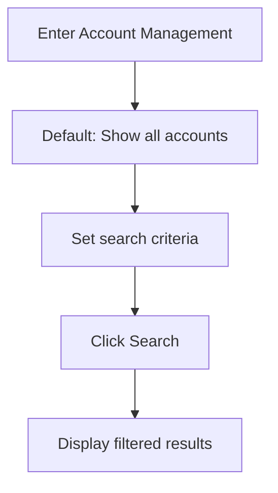
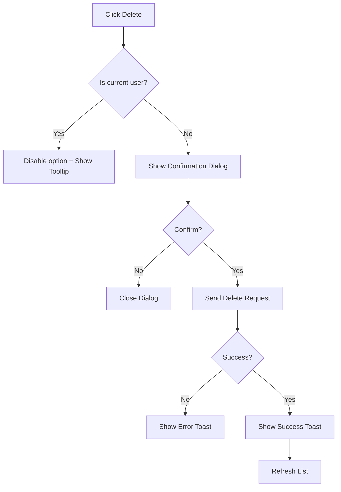

# Account Management Feature Specification

## 1. Overview & Primary Functions
The account management system provides administrators with tools to search, view, create, update, and remove system users while maintaining strict security constraints.

1.  **Search Accounts**: Filter users by department, status, or keywords.
2.  **View Account**: Access full user profiles in a read-only mode.
3.  **Add Account**: Create new user identities with default credentials.
4.  **Edit Account**: Modify existing profile data and permissions.
5.  **Delete Account**: Remove users from the system (self-deletion is restricted).

---

## 2. User Flow / System Logic

### 2.1 Search Workflow
1. User enters the Account Management page; the full list is displayed by default.
2. User applies filters: Department, Status, or Keywords.
3. System fetches and reloads the filtered results upon clicking "Search".

### 2.2 Creation Workflow
1. User clicks "Add New" in the toolbar.
2. User fills the form with mandatory and optional fields.
3. System performs frontend validation.
4. **On Submission**:
   - If frontend validation fails → Show field errors.
   - If backend detects duplicate account → Show Toast error.
   - If success → Show success Toast and return to the list.

### 2.3 Deletion Workflow
1. User clicks "Delete" on a specific row.
2. **If target is self** → Delete option is disabled; tooltip explanation provided.
3. **If target is another user** → Show "Are you sure?" confirmation dialog.
4. **Outcome**:
   - Success → Show success Toast; refresh list.
   - Failure → Show error Toast.

---

## 3. Functional Rules & Business Logic

### 3.1 Field Specifications
| Field             | Type     | Required | Rules                                                       |
| :---------------- | :------- | :------- | :---------------------------------------------------------- |
| Username          | Text     | Yes      | 4-20 alphanumeric characters. Immutable after creation.     |
| Role              | Dropdown | Yes      | Options: Admin, Standard User. Restricted for self-editing. |
| Status            | Radio    | Yes      | Active or Inactive. Restricted for self-editing.            |
| Registration Date | Display  | -        | Generated by system. Read-only.                             |

### 3.2 Key Business Rules
- **Account Uniqueness**: Each username must be unique across the system.
- **Self-Modification Lockdown**: To prevent lockout, users cannot delete themselves or change their own role/status.
- **Initial Password**: New accounts are assigned a temporary default password (`firstPassword!@#`) upon creation.

---

## 4. UI/UX & Interaction
- **Tooltip Previews**: Hovering over truncated text (like descriptions) shows the full content.
- **Role-based Visiblity**: Sensitive information (like registration date) is only visible in View/Edit modes.
- **Confirmation Hazards**: All destructive actions (Delete) require explicit confirmation.

---

## 5. System Integration & API
| Function    | Endpoint         | Method | Auth Required |
| :---------- | :--------------- | :----- | :------------ |
| List Users  | `/api/users`     | GET    | Yes           |
| Create User | `/api/users`     | POST   | Yes           |
| Update User | `/api/users/:id` | PATCH  | Yes           |
| Delete User | `/api/users/:id` | DELETE | Yes           |

---

## 6. Error & Feedback Mapping
| Context            | Source       | Feedback Type | Display Message                                        |
| :----------------- | :----------- | :------------ | :----------------------------------------------------- |
| Duplicate Username | Backend      | Toast         | "This username is already taken."                      |
| Self-Deletion      | Frontend/API | Disabled/403  | "You cannot delete your own account."                  |
| Validation Error   | Frontend     | Field Hint    | "Username must be 4-20 characters."                    |
| Fetch Failure      | Backend      | Dialog        | "Failed to load account list. Please try again later." |
