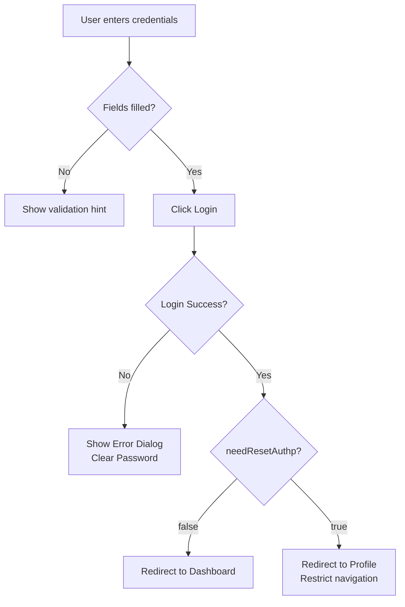

# User Login Feature Specification

## 1. Overview & Primary Functions
The login page allows users to authenticate themselves, manage forgotten passwords, and reset their credentials securely.

1.  **Authentication**: Users enter their account and password to access the system.
2.  **Forgot Password**: Triggers a recovery process via email with a verification code.
3.  **Password Reset**: Allows users to set a new password using a recovery code and CAPTCHA.

---

## 2. User Flow / System Logic

### 2.1 Login Workflow
1. User enters "Account" and "Password" on the login page.
2. Both fields are mandatory; the submit button triggers frontend validation if empty.
3. Upon clicking "Login", the system sends an authentication request to the backend.
4. **On Failure**:
   - A dialog displays "Login Failed" with a descriptive message (e.g., "Invalid username or password").
   - Password field is cleared, while the account field is retained.
5. **On Success**:
   - System retrieves a JWT Token and `needResetAuthp` status.
   - If `needResetAuthp` is **false** → Redirect to Dashboard.
   - If `needResetAuthp` is **true** → Force redirect to the Profile page (`/profile`). Only password updates or logout are allowed until the password is changed.

---

## 3. Functional Rules & Business Logic

### 3.1 Authentication Rules
| Rule             | Description                                                                                                       |
| :--------------- | :---------------------------------------------------------------------------------------------------------------- |
| Mandatory Fields | Account and Password are required.                                                                                |
| Error Handling   | Dialog-based feedback for failures; clear sensitive input.                                                        |
| Password Expiry  | If `needResetAuthp=true` (e.g., first login or 6 months since last change), user is locked into the Profile page. |

### 3.2 Recovery & Reset Rules
| Rule               | Description                                                             |
| :----------------- | :---------------------------------------------------------------------- |
| Recovery Email     | Must match the account's registered email.                              |
| Code Validity      | Recovery codes are valid for **5 minutes**.                             |
| CAPTCHA            | Required for password resets to prevent bot abuse; valid for 5 minutes. |
| History Constraint | New password **cannot be the same as the last 3 passwords**.            |

---

## 4. UI/UX & Interaction
- **Visibility Toggle**: Password fields include an icon to show/hide text.
- **Rules Tooltip**: A help icon displays password complexity requirements on hover.
- **Button States**: Submit buttons enter a "Loading" state during API requests to prevent double submissions.

---

## 5. System Integration & API
| Function        | Endpoint                     | Method | Auth Required |
| :-------------- | :--------------------------- | :----- | :------------ |
| Login           | `/api/auth/login`            | POST   | No            |
| Logout          | `/api/auth/logout`           | POST   | Yes           |
| Forgot Password | `/api/users/forgot-password` | POST   | No            |
| Reset Password  | `/api/users/reset-password`  | POST   | No            |

---

## 6. Error & Feedback Mapping
| Context              | Source   | Feedback Type | Display Message                                            |
| :------------------- | :------- | :------------ | :--------------------------------------------------------- |
| Invalid Credentials  | Backend  | Dialog        | "Invalid username or password."                            |
| Expired Code         | Backend  | Toast         | "The recovery code has expired. Please request a new one." |
| Password History     | Backend  | Toast         | "New password cannot match your previous 3 passwords."     |
| Mismatched Passwords | Frontend | Field Hint    | "Passwords do not match."                                  |