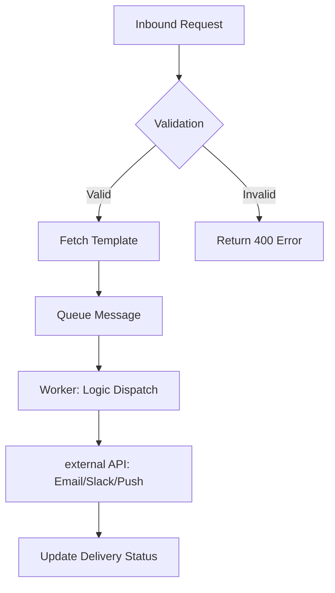

# Internal Notification Service (Backend-only Spec)

## 1. Overview & Primary Functions
The Notification Service provides a centralized API for sending alerts (Email, Slack, Push) to users and internal systems based on event-driven triggers.

1.  **Event Ingestion**: Receive notification requests from other microservices via REST or Message Queue.
2.  **Template Management**: Dynamically inject data into pre-defined templates for different channels.
3.  **Dispatching**: Route messages to external providers (SendGrid, Twilio, Slack API).
4.  **Logging & Audit**: Track the status of every notification (Pending, Sent, Failed).

---

## 2. System Logic / Data Flow

### 2.1 Message Processing Flow
1. An upstream service calls the `POST /notify` endpoint.
2. The service validates the `template_id` and `recipient` data.
3. The system fetches the corresponding template from the database.
4. Data interpolation (merging user variables into the template).
5. The message is queued for the worker to process.
6. The worker selects the provider and attempts delivery.



---

## 3. Functional Rules & Business Logic

### 3.1 Dispatching Rules
| Rule           | Description                                                                                                |
| :------------- | :--------------------------------------------------------------------------------------------------------- |
| Priority Queue | Critical alerts (e.g., Security) bypass the standard queue and are processed by high-availability workers. |
| Rate Limiting  | Limit notifications per user to 5 per minute for non-critical channels to prevent spam.                    |
| Retry Strategy | Failed requests to external providers are retried using exponential backoff (Max 5 attempts).              |

### 3.2 Template Rules
- **Variables**: Must follow `{{variable_name}}` syntax. 
- **Fallbacks**: If a variable is missing, the system uses a default value or fails the request based on template configuration.

---

## 5. System Integration & API

### 5.1 Notify Endpoint
- **URL**: `/api/v1/notify`
- **Method**: `POST`
- **Auth**: API Key (Header: `X-API-KEY`)

**Request Payload Example**:
```json
{
  "template_id": "welcome_email",
  "recipient": "user@example.com",
  "variables": { "name": "John Doe" },
  "priority": "normal"
}
```

### 5.2 External Dependencies
- **Email**: SendGrid API
- **Slack**: Webhook Integration
- **SMS**: Twilio

---

## 6. Error & Feedback Mapping
*Note: Backend errors are primarily returned as JSON responses.*

| Error Code              | Scenario                | Feedback Type | Display Message / Response                    |
| :---------------------- | :---------------------- | :------------ | :-------------------------------------------- |
| 400 Bad Request         | Missing required fields | JSON Body     | "Missing field: recipient"                    |
| 401 Unauthorized        | Invalid API Key         | JSON Body     | "Invalid or expired API Key"                  |
| 422 Unprocessable       | Template ID not found   | JSON Body     | "Template [id] does not exist"                |
| 503 Service Unavailable | Worker queue full       | JSON Body     | "Service temporarily unavailable. Try again." |
