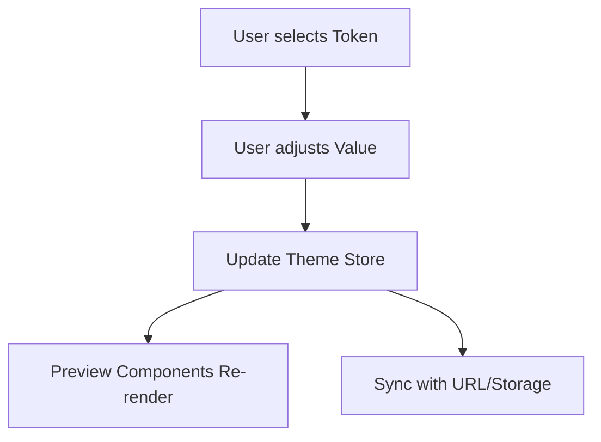

# Theme Customization Editor (Frontend-only Spec)

## 1. Overview & Primary Functions
The Theme Editor allows developers to visually customize application design tokens (colors, typography, spacing) and preview changes in real-time.

1.  **Visual Token Editing**: Modify HSL color values, font families, and global spacing via a sidebar interface.
2.  **Real-time Preview**: Immediate reflection of changes on a set of common UI components (buttons, cards, inputs).
3.  **Code Export**: Generate production-ready CSS variables or configuration objects based on the customized theme.

---

## 2. User Flow / System Logic

### 2.1 Customization Workflow
1. User opens the Theme Editor.
2. User selects a color category (e.g., "Primary", "Background").
3. User adjusts the color using a picker or text input.
4. **Internal State Update**: The application updates the global theme state (e.g., React Context or Store).
5. **Component Re-render**: Preview components subscribe to the theme state and update their styles dynamically.

---

## 3. Functional Rules & Edge Cases

### 3.1 Interaction Rules
| Rule             | Description                                                                                                                |
| :--------------- | :------------------------------------------------------------------------------------------------------------------------- |
| Live Sync        | All inputs must debounced but provide visual feedback within 50ms for perceived performance.                               |
| Invalid Values   | If an invalid color hex or HSL is entered, the input displays a red border and persists the last valid state in the store. |
| Contrast Warning | (Optional) Show a warning icon if the selected foreground/background color combination fails WCAG AA standards.            |

### 3.2 State Management
- **Persistence**: Theme changes are saved to `localStorage` automatically to prevent data loss on refresh.
- **Reset**: A "Reset to Default" button restores all tokens to their initial values.

---

## 4. UI/UX & Interaction
- **Sidebar Panels**: Group tokens by category: Colors, Typography, Shapes.
- **Preview Area**: Contains a "Sample Page" showcasing various UI elements (Modals, Buttons, Charts).
- **Responsive Toggle**: Ability to view the preview area in Mobile, Tablet, and Desktop resolutions.
- **Glassmorphism Effects**: Implementation of subtle transparency and blur for the editor panels.

---

## 6. Error & Feedback Mapping
*Note: As this is frontend-only, errors focus on validation and storage.*

| Context          | Scenario          | Feedback Type | Display Message                                       |
| :--------------- | :---------------- | :------------ | :---------------------------------------------------- |
| Input Validation | Invalid Hex Code  | Input Border  | "Please enter a valid Hex code."                      |
| Storage          | LocalStorage Full | Toast         | "Settings could not be saved locally (Storage Full)." |
| Export           | Copy to Clipboard | Toast         | "Theme config copied to clipboard!"                   |

---

## Appendix
- **Design System Tokens**: Primary, Secondary, Accent, Neutral, Destructive.
- **Typography Sets**: Base Font, Heading Font, Monospace.
