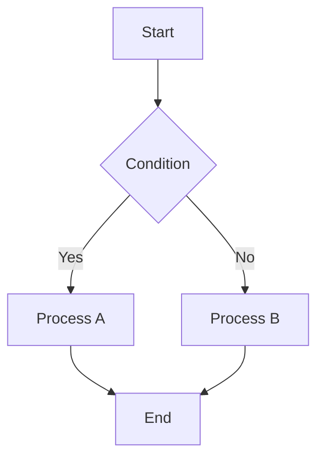

# {Feature or Page Name} Feature Specification

## 1. Overview & Primary Functions
*List the main goals and functions of this feature or page.*

1. Function A: Description of the goal.
2. Function B: Description of the goal.
3. Function C: Description of the goal.

---

## 2. User Flow / System Logic
*Describe how a user interacts with this feature or how the system processes data. Use steps and Mermaid diagrams for clarity.*

### 2.1 Major Workflow
1. Step 1: User action or system trigger.
2. Step 2: System processing or UI transition.
3. Step 3: Expected outcome.

---

## 3. Functional Rules & Edge Cases
*Define the specific business rules, input validations, constraints, and how the system handles unusual scenarios. Use tables for readability.*

### 3.1 Business Rules
| Rule   | Description                                      |
| :----- | :----------------------------------------------- |
| Rule 1 | Detailed explanation of the constraint or logic. |
| Rule 2 | Detailed explanation of the constraint or logic. |

### 3.2 Input Validation & Edge Cases
| Scenario        | Behavior / Constraint                  |
| :-------------- | :------------------------------------- |
| Empty Input     | How the system should respond.         |
| Invalid Format  | Validation rules (e.g., regex, range). |
| Network Timeout | Graceful degradation or error message. |

---

## 4. UI/UX & Interaction (Recommended for: Frontend-Heavy Projects)
*Detail the visual components, layout, and user feedback mechanisms.*

- **Design System Tokens**: List colors, typography, or spacing if relevant.
- **Interactive Elements**: Hover states, loading indicators, and transitions.
- **Responsive Behavior**: How the UI adapts to different screen sizes.

---

## 5. System Integration & API (Recommended for: Full-stack or Backend Projects)
*List relevant API endpoints, data synchronization points, or external service integrations.*

| Function    | Endpoint           | Method | Auth Required |
| :---------- | :----------------- | :----- | :------------ |
| Fetch Data  | `/api/v1/resource` | GET    | Yes           |
| Create Item | `/api/v1/resource` | POST   | Yes           |

---

## 6. Error & Feedback Mapping
*Map specific technical errors or system states to user-facing feedback.*

| Context          | Source (Logic/API) | Feedback Type    | Display Message                                |
| :--------------- | :----------------- | :--------------- | :--------------------------------------------- |
| Unauthorized     | 401 Unauthorized   | Redirect / Toast | "Please sign in to continue."                  |
| Resource Missing | 404 Not Found      | Component State  | "The item you are looking for does not exist." |

---

## Appendix: Extended Details (Optional)
*Include these sections based on complexity:*

- **Use Case Diagram**: For multi-role interactions.
- **Data Dictionary**: For defining specific data fields and types.
- **Permission Matrix**: For access control across different user roles.
- **Glossary**: For domain-specific terminology.
